# 🌍 DOSSIER DE CONFIGURATION D'EXPLOITATION (DCE)

## ⚡ PLATEFORME SOC — SIEM Python · SOAR Automatisé · Threat Intelligence · Dashboard Exécutif

<p align="center">
  
  
  
  
  
  
  
  
</p>

> ⚠️ **NB IMPORTANT :** Il s'agit d'un projet **personnel/étudiant**. Le contexte assurantiel est utilisé uniquement pour donner un cadre d'entreprise réaliste à cette simulation. Aucune donnée réelle ou privée n'est exploitée. Tous les événements, logs, adresses IP et rapports sont entièrement fictifs.

---

**Version :** `4.0.0 Enterprise` &nbsp;|&nbsp; **Date :** Mars 2026 &nbsp;|&nbsp; **Auteur :** KAMENI TCHOUATCHEU GAETAN BRUNEL
**Contact :** [gaetanbrunel.kamenitchouatcheu@et.esiea.fr](mailto:gaetanbrunel.kamenitchouatcheu@et.esiea.fr)

---

## 📋 TABLE DES MATIÈRES

1. [🎯 Vue d'ensemble](#-vue-densemble-du-projet)
2. [🏗️ Architecture Globale](#-architecture-du-projet)
3. [📈 Scénarios d'Incidents & Playbooks SOAR](#-scénarios-dincidents--playbooks-soar)
4. [📊 Fonctionnalités Clés & Dashboard](#-fonctionnalités-clés--dashboard-exécutif)
5. [📡 Module CTI Open-Source](#-module-cti-open-source)
6. [⚖️ Scoring Assurantiel & Compliance RGPD](#️-scoring-assurantiel--compliance-rgpd)
7. [🌪️ Défis & Intempéries Rencontrées](#️-défis--intempéries-rencontrées)
8. [🛠️ Technologies Utilisées](#️-technologies-utilisées)
9. [🚀 Guide d'Installation & Run Book](#-guide-dinstallation--run-book)
10. [✨ Qualité & Best Practices](#-qualité--best-practices)
11. [🗺️ Roadmap & Évolutions](#️-roadmap--évolutions)

---

## 🎯 Vue d'ensemble du Projet

### Contexte & Objectifs

Ce projet est un **démonstrateur complet d'ingénierie Cybersécurité** orienté Détection et Réponse à Incident. Il simule une plateforme SOC de bout-en-bout : depuis la génération de logs d'attaques, leur détection par un moteur SIEM basé sur MITRE ATT&CK, jusqu'à l'éradication automatisée de la menace par un moteur SOAR interagissant avec de vraies APIs d'entreprise simulées (EDR, Active Directory, Messagerie).

| Dimension | Ce que ça démontre |
| :--- | :--- |
| **Détection (SIEM)** | Moteur d'analyse de logs Python avec règles de corrélation inspirées du standard Sigma |
| **Automatisation (SOAR)** | Playbooks Python faisant de vrais appels HTTP de remédiation (Isolation réseau, Reset MDP, Révocation token AD) |
| **Mocking d'Infrastructure** | Serveur FastAPI simulant EDR / Active Directory / Messagerie — prêt à brancher sur de vrais outils |
| **Threat Intelligence (CTI)** | Interrogation en direct de l'API AlienVault OTX et des bulletins gouvernementaux CISA KEV |
| **Case Management** | Export structuré au format JSON TheHive avec Observables, Tasks et Custom Fields |
| **Compliance Assurantielle** | Scoring du risque métier (contrats exposés, RGPD, délai CNIL 72h) automatisé par playbook |
| **Tableau de Bord Exécutif** | Application Streamlit localhost affichant MTTD, MTTR, alertes CTI et rapports en temps réel |

---

## 🏗️ Architecture du Projet

<p align="center">
  
</p>

### Flux de traitement (Detect → Contain → Report)

```
[Simulateurs d'Attaques]
        │ Payloads JSON d'événements malveillants
        ▼
[Moteur SIEM Python]  ←── Règles MITRE ATT&CK (T1486, T1566, T1078)
        │ Alerte générée
        ▼
[Moteur SOAR Python]  ←── Enrichissement CTI (AlienVault OTX)
        │ Requêtes HTTP de remédiation
        ▼
[API Mock EDR/AD/Mail] (FastAPI sur port 8080)
        │ Réponse 200 OK (Isoler / Reset / Supprimer)
        ▼
[Reporting Incident]  ──► Rapport Markdown/PDF + Ticket TheHive JSON
        │
        ▼
[Dashboard Streamlit] ──► KPIs | Observables CTI | Risque RGPD | SOP
```

---

## 📈 Scénarios d'Incidents & Playbooks SOAR

Trois scénarios majeurs entièrement automatisés, contextualisés au secteur assurantiel :

| Scénario | Tactique MITRE ATT&CK | Actions Automatisées du Playbook SOAR |
| :--- | :--- | :--- |
| **🔴 Ransomware** | `T1486` — Data Encrypted for Impact | Isolement EDR (API POST) + Arrêt du partage réseau `/data/contrats/` + Alerte P1 RSSI/Cellule Crise |
| **🟠 Phishing / Spear-Phishing** | `T1566.001` — Spearphishing Link | Analyse de réputation URL via CTI OTX + Suppression du mail (API) + Reset MDP préventif |
| **🟡 Compromission de Compte (VIP)** | `T1078` — Valid Accounts / Impossible Travel | Révocation du token AD (API) + Enforce MFA + Notification niveau P1 + Audit Trail |

---

## 📊 Fonctionnalités Clés & Dashboard Exécutif

### Portail SOC de Supervision (Streamlit — Localhost)

*Dashboard Web interactif à deux onglets : Gestion des Incidents SOC d'un côté, Flux de Threat Intelligence de l'autre.*

<p align="center">
  
</p>

> 📥 **[Télécharger le Rapport Exécutif Complet (Export PDF)](<SOC Executive Dashboard.pdf>)**

### 1. 🤖 Moteur SOAR Interactif (API EDR Mock)
Contrairement aux simulations classiques opérant avec de simples `print()`, ce SOAR utilise la librairie `requests` pour attaquer un serveur FastAPI local simulant un vrai EDR. Cela **prouve la viabilité totale des scripts en production** sur des outils comme CrowdStrike, SentinelOne ou Microsoft Defender. Un mécanisme de *fallback gracieux* évite tout crash si l'API est indisponible.

### 2. 🎫 Export Automatisé TheHive (Case Management)
À la fin de chaque exécution, le SOAR extrait tous les IOC (IPs, hashes, URLs), TLP, PAP et TTPs MITRE pour forger dynamiquement un ticket `.json` au format TheHive. Ce ticket contient les tâches structurées pour l'analyste N1/N2, les métriques de performance et les champs RGPD.

### 4. 🗺️ MITRE ATT&CK Navigator — Heatmap de Couverture
Le fichier [`attck/coverage_layer.json`](attck/coverage_layer.json) est un layer ATT&CK Navigator prêt à l'emploi. Il mappe toutes les techniques détectées avec leur niveau de couverture (score 0→100).

> **💡 Pour visualiser la heatmap :**
> 1. Ouvrir [https://mitre-attack.github.io/attack-navigator/](https://mitre-attack.github.io/attack-navigator/)
> 2. Cliquer **"Open Existing Layer"** → **"Upload from local"**
> 3. Sélectionner `attck/coverage_layer.json`

| Technique | Tactique | Score |
| :--- | :--- | :--- |
| T1566 / T1566.001 | Initial Access — Phishing | 🔴 95/100 |
| T1486 | Impact — Ransomware | 🔴 90/100 |
| T1078 | Initial Access — Valid Accounts | 🔴 90/100 |
| T1110 | Credential Access — Bruteforce | 🟠 80/100 |
| T1190 | Initial Access — Exploit (CISA KEV) | 🟠 70/100 |

---

## 🤖 Intégration Continue (CI/CD DevSecOps)

Chaque `git push` sur la branche `main` déclenche automatiquement le pipeline **GitHub Actions** (`.github/workflows/test_playbooks.yml`) qui vérifie :
- ✅ L'importabilité de tous les modules Python (SIEM, SOAR, CTI, Dashboard)
- ✅ La présence et structure de tous les fichiers critiques
- ✅ La conformité du format JSON des rapports TheHive
- ✅ La validité du fichier MITRE ATT&CK Navigator

---

## 📡 Module CTI Open-Source

Le projet intègre deux connecteurs de renseignement sur les menaces en temps réel :

### 🌍 AlienVault OTX (`scripts/cti/otx_ioc_lookup.py`)
- Interroge l'API publique AlienVault Open Threat Exchange en direct.
- Analyse n'importe quel IOC (IP, domaine, hash) et retourne le nombre de **campagnes d'attaques mondiales** dans lesquelles il apparaît.
- Visualisé dans l'onglet CTI du Dashboard Streamlit avec code couleur Rouge/Vert.

### 🇺🇸 CISA KEV — Gouvernement US (`scripts/cti/cisa_kev_puller.py`)
- Télécharge en direct le catalogue des **Known Exploited Vulnerabilities** du CISA (Agence de Cybersécurité du gouvernement américain).
- Corrèle automatiquement les CVEs avec le **parc applicatif simulé du secteur assurantiel** (FortiOS, Exchange Server, Guidewire...).
- Génère une alerte si une faille activement exploitée par des ransomwares cible ton SI.

---

## ⚖️ Scoring Assurantiel & Compliance RGPD

Module critique et différenciant pour le secteur Assurance/Banque :

- **Calcul du risque métier** : Nombre de contrats potentiellement exposés par type d'incident.
- **Détection automatique de Fuite RGPD** : Le playbook SOAR évalue si les données compromises sont des données personnelles (santé, habitation, auto).
- **Notification CNIL obligatoire** : Si une fuite est confirmée, le ticket TheHive génère automatiquement la tâche `⚖️ Déclaration CNIL sous 72H`, respectant l'article 33 du RGPD.
- **KPIs de Performance SOC** : MTTD (Temps Moyen de Détection) et MTTR (Temps Moyen de Réponse) calculés et exposés dans le Dashboard et les tickets TheHive.

---

## 🌪️ Défis & Intempéries Rencontrées

La construction de cette plateforme sans Docker ni solutions pré-packagées a soulevé plusieurs complexités techniques :

- **Conflit d'Environnements Windows (Python) :** Windows interceptait les appels Python via une installation MinGW/MSYS64 dépourvue de `pip`. Résolution : forçage du chemin absolu de l'interpréteur `pyenv-win` pour garantir l'exécution propre du serveur FastAPI.

- **Compatibilité Pydantic v1 vs Python 3.12+ :** Le démarrage du serveur FastAPI crashait sur `TypeError: ForwardRef._evaluate() missing 1 required keyword-only argument`. Ce bug venait du changement de signature interne du cache de typage dans Python 3.12.4+. **Résolution :** Diagnostic à chaud et upgrade vers Pydantic v2.

- **Mocking d'orchestration réseau asynchrone :** Simuler le SOAR sans bloquer la boucle principale du SIEM au moment des appels HTTP externes nécessite une rigueur algorithmique stricte pour ne pas perdre les événements en attente dans la queue.

- **Gestion des exports en doublon :** L'exécution répétée du moteur générait des centaines de rapports quasi-identiques dans `reports/generated/`. Résolution : nettoyage automatisé et politique de rétention (1 rapport par type de scénario).

---

## 🛠️ Technologies Utilisées

| Composant | Technologie | Usage |
| :--- | :--- | :--- |
| **Core SIEM/SOAR** | Python 3.12+ | Moteur de détection, playbooks de remédiation, files d'attente d'événements |
| **API de Sécurité (Mock)** | FastAPI + Uvicorn | Simulation d'EDR / Active Directory / Messagerie corporate |
| **Dashboard Analytique** | Streamlit | Portail Web interactif avec onglets Incidents + CTI |
| **Threat Intelligence** | AlienVault OTX · CISA KEV | Enrichissement IOC et veille vulnérabilités en temps réel |
| **Reporting / Templates** | Jinja2 + Markdown | Rapports d'incident de niveau exécutif générés automatiquement |
| **Case Management** | JSON (Format TheHive) | Tickets structurés avec Custom Fields MTTD/MTTR/RGPD |
| **Documentation SOC** | Markdown (SOP) | Standard Operating Procedures selon les normes SOC de Groupe |

---

## 🚀 Guide d'Installation & Run Book

> **Pré-requis :** Python 3.10+ installé. Vérifiez que la commande `python` pointe vers la bonne installation (via `python --version`).

### 📦 Étape 1 — Installation des dépendances (une seule fois)

```bash
pip install -r requirements.txt
```

### 🌐 Étape 2 — Démarrage du Serveur EDR/AD Mock (Terminal 1)

Laissez ce terminal ouvert en arrière-plan. Il représente les équipements de sécurité de l'entreprise.

```bash
python scripts/mock_edr_api.py
```
*Serveur actif sur `http://127.0.0.1:8080` — à laisser tourner*

### 🛡️ Étape 3 — Simulation de Cyberattaque & Réponse Automatisée (Terminal 2)

Le SIEM détecte → Le SOAR répond → L'API Mock confirme l'isolation.

```bash
# Scénario Ransomware (MITRE T1486 — Data Encrypted for Impact)
python scripts/soc_engine.py --scenario ransomware

# Scénario Phishing Assurantiel (MITRE T1566.001 — Spearphishing Link)
python scripts/soc_engine.py --scenario phishing
```

### 📊 Étape 4 — SOC Executive Dashboard (Terminal 3)

```bash
python -m streamlit run scripts/dashboard_soc.py
```
*Navigateur → `http://localhost:8501` — 2 onglets : Incidents SOC & Threat Intelligence CTI*

### 📡 Étape 5 — Cyber-Veille Open-Source (Facultatif, n'importe quel terminal)

```bash
# Réputation IP mondiale via AlienVault OTX (API publique sans clé)
python scripts/cti/otx_ioc_lookup.py

# Catalogues vulnérabilités du gouvernement US — CISA KEV
python scripts/cti/cisa_kev_puller.py
```

---

## ✨ Qualité & Best Practices

- **Ingénierie Logicielle :** Utilisation intensive des `dataclasses` Python pour modéliser précisément les objets de sécurité (Alerte, IOC, Observable, PlaybookAction).
- **Logging Professionnel :** `colorlog` avec niveaux de criticité lisibles par la supervision (DEBUG/INFO/WARNING/CRITICAL).
- **Dégradation Gracieuse :** Mode *Fail-Safe* sur tous les Playbooks — si l'API EDR est indisponible, le SOAR continue son exécution sans crash (`try/except` exhaustif).
- **Résilience CTI :** Les scripts de veille gèrent proprement les erreurs réseau (timeout, 404, 502) sans interrompre le pipeline SIEM principal.
- **Documentation Procédurale :** Les Standard Operating Procedures (SOP) complètes sont disponibles dans [`docs/SOP_Reponse_Incident.md`](docs/SOP_Reponse_Incident.md) — reproduisant les standards documentaires d'un SOC de Groupe assurantiel.
- **Portabilité :** `requirements.txt` strict, commandes génériques (`python`, pas de chemin absolu hard-codé) — le projet tourne sur n'importe quel poste.

---

## 🗺️ Roadmap & Évolutions

<p align="center">
  
</p>

**Version Actuelle : `4.0.0 Enterprise` ✅**
- ✅ Moteur SIEM/SOAR Python asynchrone fonctionnel
- ✅ API Mock EDR/Active Directory (FastAPI) avec appels HTTP réels
- ✅ Dashboard Streamlit interactif (Onglets Incidents + CTI)
- ✅ Scoring de risque assurantiel (Contrats exposés, RGPD, CNIL 72h)
- ✅ Threat Intelligence Live (AlienVault OTX + CISA KEV)
- ✅ Export TheHive JSON avec Custom Fields MTTD/MTTR

**Vision Industrielle (Sprints Futurs) 🔮**
- 🔲 **ITSM ServiceNow :** Push API direct vers un ticket ServiceNow pour workflow de validation humaine
- 🔲 **Standard CACAO / STIX 2.1 :** Formalisation des Playbooks selon le standard OASIS industriel
- 🔲 **CI/CD DevSecOps :** GitHub Actions testant automatiquement la résilience des playbooks
- 🔲 **Sigma Rules YAML :** Migration des règles Python vers un parseur Sigma standard

---

## 🤝 Contribution
Les contributions sont les bienvenues pour enrichir ce démonstrateur (nouveaux scénarios MITRE ATT&CK, nouveaux connecteurs CTI, etc.).

## 📄 Licence
Projet développé dans un cadre académique et professionnel. Droits réservés.

## 👨‍💻 Auteur

**KAMENI TCHOUATCHEU GAETAN BRUNEL**
*Futur Ingénieur Cybersécurité | Analyste SOC | Étudiant ESIEA*

📧 [gaetanbrunel.kamenitchouatcheu@et.esiea.fr](mailto:gaetanbrunel.kamenitchouatcheu@et.esiea.fr) &nbsp;·&nbsp; 🐙 [@Lkb-2905](https://github.com/Lkb-2905)

---

🙏 **Remerciements**
- **L'Écosystème des Mutuelles et Assurances** — Pour l'inspiration des standards opérationnels de la menace Cyber en milieu critique.
- **ESIEA** — Pour l'excellence de la formation ingénieur.

---

⭐ *Si ce projet vous semble pertinent pour la protection des systèmes de demain, laissez une étoile !*
*Fait avec ❤️, Python, et une bonne dose d'Investigation Numérique.*

© 2026 Kameni Tchouatcheu Gaetan Brunel — Tous droits réservés.
